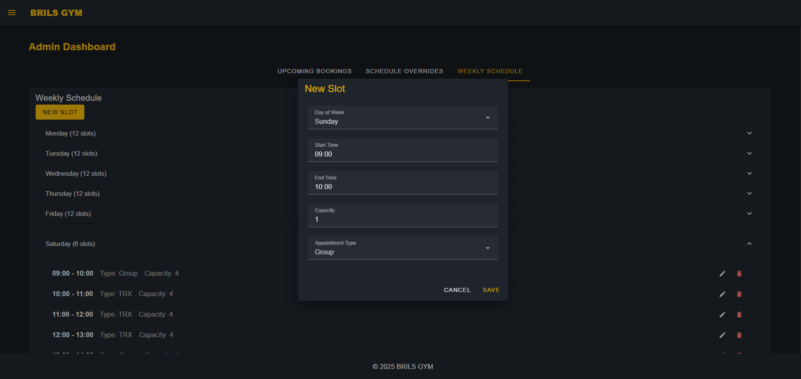
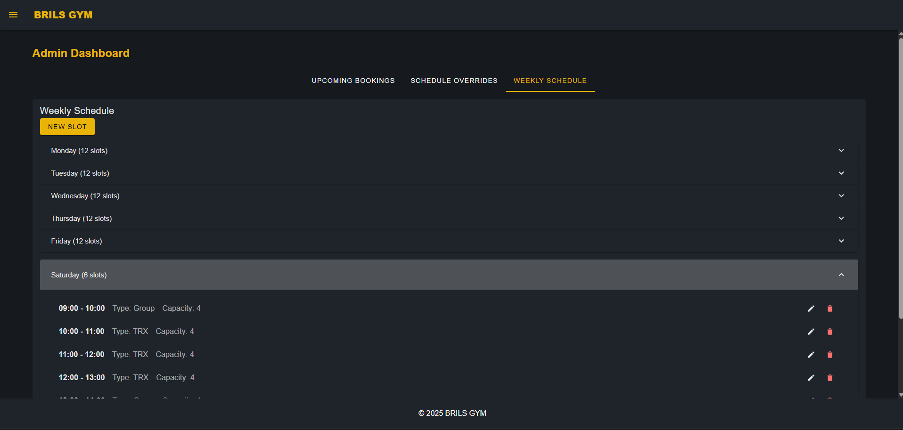
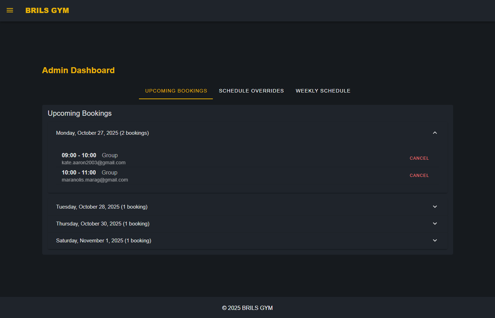
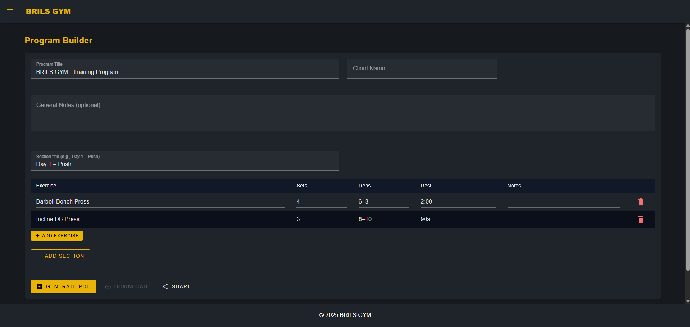
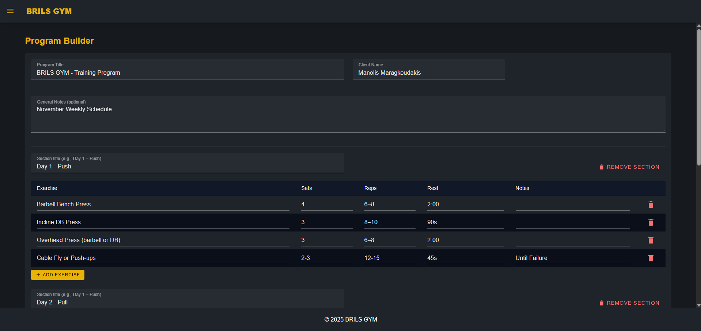
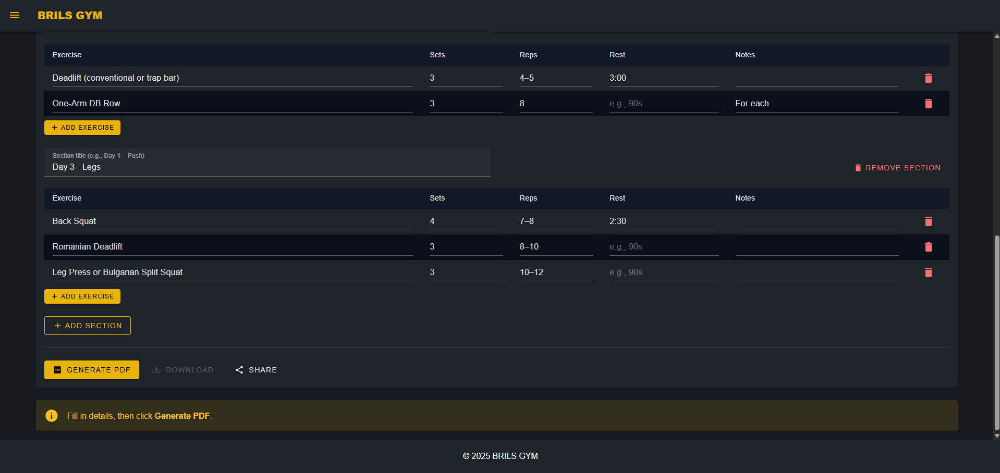
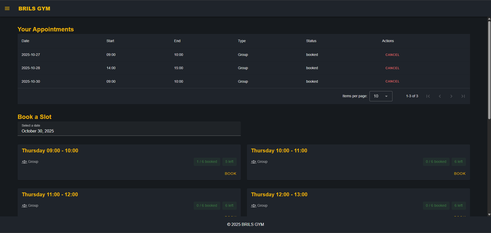
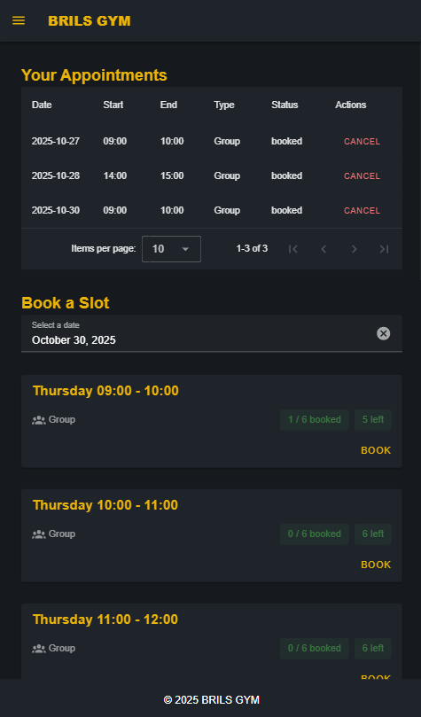
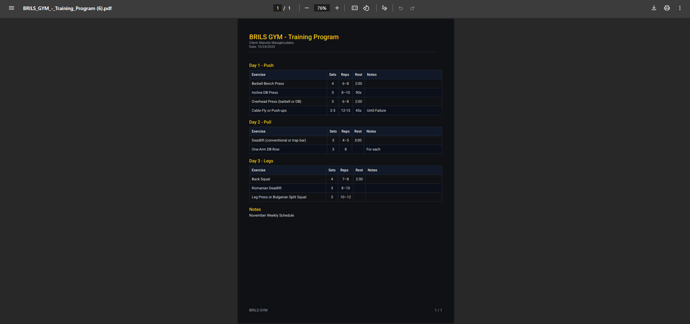

# Personal Training Appointments PWA

A lightweight Progressive Web App for trainers to manage sessions and for clients to book available time slots.

**Live demo:** [https://manosmrgk.github.io/training-pwa/](https://manosmrgk.github.io/training-pwa/)

## Stack

- Frontend: Vue.js

- Backend: Supabase (auth, DB, storage)

## Features

- Trainer: manage availability and appointments, export branded training programs for clients (PDF)

- Client: browse slots, book/reschedule/cancel (within rules)

- PWA: installable, offline-ready core pages

# Demo: Training PWA: Admin & Client Walkthrough

This section illustrates the key flows in the Training PWA for both **admin** and **client** users using the latest demo screenshots (captured on Oct 24, 2025).

---

## Admin Experience

### Create a New Training Slot

*Set up a new training slot with date/time, capacity, and visibility options.*

### Weekly Schedule Overview

*See all sessions at a glance, drag to reschedule, and click to edit details.*

### Upcoming Bookings

*Monitor who’s booked into which sessions, filter by date, and manage attendance.*

---

## Program Builder

### Empty State

*Start a new program from scratch or pick a template to accelerate setup.*

### Example (Program Details Configuration)

*Define phases, days, and exercises with sets, reps, tempo, and cues.*

### Example (Generate the PDF)

*Use the Generate Button to produce the final PDF You can download it or share it directly with an email*

---

## Client Experience

### Client: Desktop

*Clients browse their schedule, open sessions, schedule and cancel appointments.*

### Client: Mobile

*Responsive mobile layout for quick checks and in-gym usage.*

---

## Program Output (Export/Share)

*A clean, shareable output for printing or sending to clients.*

**Full sample PDF:** [Training_Program_Demo.pdf](./demo/Training_Program_Demo.pdf)
